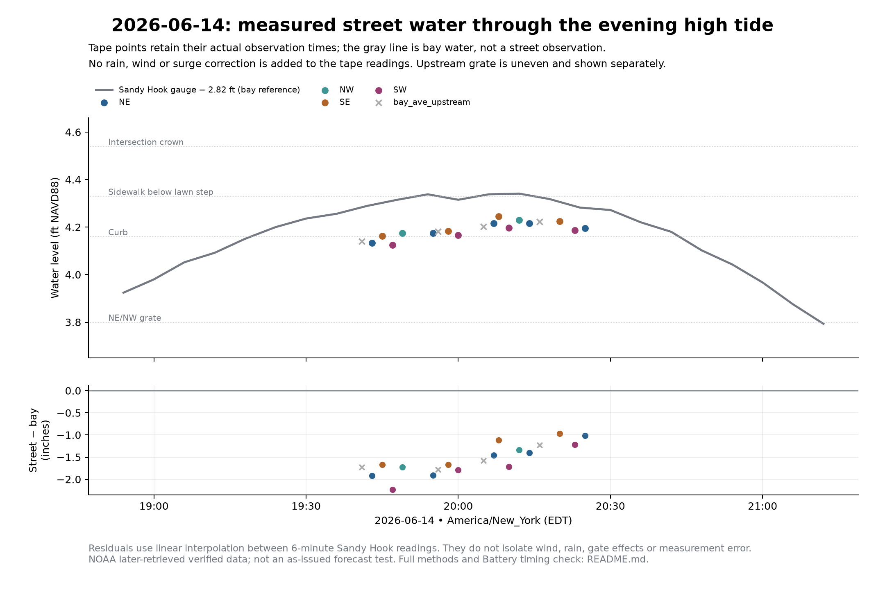

# 2026-06-14 — tape hydrograph and bay comparison

[PNG](field_hydrograph.png) · [PDF](field_hydrograph.pdf) ·
[ledger-derived input snapshot](observations.json) · [calculated results](results.json).
Renderer: [plot_expanded_observations.py](../../../../history/scripts/plot_expanded_observations.py).
Run from repo root with `~/.barnacle/venv/bin/python history/scripts/plot_expanded_observations.py`.

## Findings

- [VERIFIED: cited tape rows] Corner peak-window mean **8.413 inches
  above SW grate**, sample range **8.125–8.710**,
  from **2026-06-14T20:07:00-04:00 to 2026-06-14T20:14:00-04:00**. Rows: [36, 37, 38, 39, 40].
  The point is a mean of sequential samples, not a simultaneous reading or
  guaranteed exact crest. Range is sample spread, not uncertainty bounds.
- [VERIFIED: archived NOAA retrieval] Sandy Hook **7.161 MLLW**
  at **2026-06-14T20:12:00-04:00**. Battery **6.762 MLLW**
  at **2026-06-14T20:48:00-04:00**. Different stations have different MLLW datums;
  do not subtract their raw heights as a street correction.
- Street readings stayed roughly1–2 inches below the converted bay level through the sampled window.
  This describes the samples; it does not prove a particular wind/rain/gate cause.

## Method and source limits

The 19 plotted points come from `data/labeled_observations.csv`
with the original row contents and row locators saved in observations.json.
Each water elevation = surveyed reference + tape depth/12. SW3.52, SE3.60,
NE/NW3.80, upstream3.64, sidewalk-under-lawn4.33 ft NAVD88. Upstream is uneven
and excluded from the corner summary; sidewalk is also displayed separately.
4 proxy/unnumbered rows are retained under `excluded`, not converted
using an invented driveway/fire-hydrant elevation.

NOAA six-minute responses and exact request/retrieval metadata live under
[historical-gauge-sources](../../2026-09-27/analysis/historical-gauge-sources/).
Queries use GMT; all figure and persisted observation times use the repo's
station-time parser. Sandy Hook MLLW minus2.82 yields the plotted bay NAVD88
reference. No local enhancement, rain increment or wind correction is added.
The lower panel subtracts linearly interpolated six-minute bay levels from the
actual-time tape measurements. These residuals combine physical differences
and observation/reference errors; they are not a fitted correction term.

Each station/day has240 samples, all NOAA quality `v`. Sandy Hook flag values
include 0,0,0,0, 1,0,1,0; Battery flags: 0,0,0,0.
Nonzero flags remain in the archived raw response; no smoothing, despiking or
row deletion was applied. The flag presence and cross-station timing check are
reported, not presented as exhaustive instrument certification.

Rainfall is not assumed zero. The older event README contains weather context,
but no new rainfall reconstruction or as-issued skill assessment is claimed.
Old README unchecked logging tasks and obsolete coefficients remain historical;
the ledger snapshot here shows what is actually recorded. Do not reuse old
model-derived proxy elevations as independent validation measurements.
