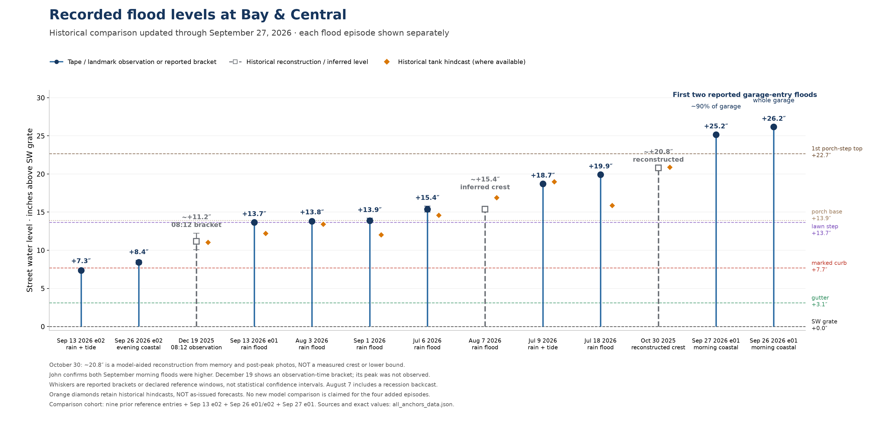

# September 27 comparison and original-note reconciliation

Prepared by Codex (GPT-6), 2026-09-27. Offline descriptive work; no model
promotion, coefficient change, or as-issued skill verdict.

## Updated all-anchors figure

[PNG](all_anchors.png) · [PDF](all_anchors.pdf) ·
[exact values and sources](all_anchors_data.json) · [renderer](all_anchors_figure.py).
Rebuild: `~/.barnacle/venv/bin/python assets/observations/2026-09-27/analysis/all_anchors_figure.py`.

This retains the nine historical entries from the September 1 comparison and
adds September 13 e02, September 26 e01/e02, and September 27 e01: thirteen
reference levels, not thirteen independent storms or thirteen tape-measured
crests. The comparison is not a census of all registered episodes. Dry checks,
smaller historical tide checks and the unmeasured August 27 flood are indexed
elsewhere rather than assigned invented peak values here.

- September 26/27 morning levels come directly from measured porch-base
  depths plus the surveyed base elevation: **26.17 / 25.17 inches above SW
  grate**, displayed as 26.2 / 25.2. Neither rain nor surge is added to those
  measured street levels. Garage extent is separate owner-reported evidence.
- September 26 e02 uses the explicit **curb +0.5–1-inch** report, yielding
  **8.18–8.68 inches above SW grate**. Midpoint 8.43 is a display summary,
  not an exact measurement. The accompanying lawn-step-base phrase is not
  consistent with that height under the surveyed elevations; retain both
  originals and seek a later clarification if it matters to a fit.
- October 30's **~20.8-inch** number is a historical model-aided reconstruction,
  **not** a measured peak or measured lower bound. The September 24 evidence
  correction in its README identifies the post-peak photo's ~13.5-inch floor;
  it does not establish a 20.8-inch observation. The owner's new confirmation
  establishes the ordering below the September morning floods, not an exact
  October peak or uncertainty band. The old figure's solid “measured” marker
  and its lower-bound caption are therefore not copied.
- December 19 is an **08:12 landmark observation bracket**, not an observed
  crest. August 7's peak bracket includes a recession backcast; both have open
  markers. Whiskers are evidence/reference ranges, not confidence intervals.
- July 6 retains the owner's accepted **15.0–15.8-inch reference window**
  (BACKLOG DECISION `7/6-anchor`, 2026-08-03), centered at 15.4. The individual
  11:34 tape observation converts to 14.97; do not confuse the window's center
  with that exact measurement. September 13 e01 uses the surveyed lawn-step
  level without inventing the old figure's ±0.2-inch measurement error.
- Orange diamonds retain the historical frozen v0.10.1 recipe outputs for its
  six entries and documented rounded event hindcasts for Aug7/Sep1/Sep13 e01.
  These mix calibration and later reference cases and are **not as-issued
  forecasts or independent validation**. The four added episodes have no new
  model diamonds; gauge QC, rain forcing and gate interpretation remain open.
  A missing diamond means not evaluated here, never zero water.

Values, evidence kinds, primary ledger locators, source files and source hashes
are included in `all_anchors_data.json`. Rendering reads that receipt without
network requests or recalibration. The figure was visually inspected after
rendering; labels, episode separation and the full height range were checked.

## Owner originals versus existing records

Original files, supplied 2026-09-27 and preserved byte-for-byte:

- [Sep26 morning](../../2026-09-26/rawnotes/01-morning.txt) → `2026-09-26-e01`.
- [Sep26 evening](../../2026-09-26/rawnotes/02-evening.txt) → `2026-09-26-e02`.
- [Sep27 morning](../rawnotes/01-morning.txt) → `2026-09-27-e01`.

[Line-by-line mapping and hashes](rawnotes-reconciliation.json) cover 80 nonempty
source lines. Every explicitly timed line maps to an existing ledger timestamp
after the documented clock normalization; contextual lines are retained in the
originals. This is a transcription/reconciliation result, not validation of
every physical interpretation that was added to ledger prose. No water-depth
rows were duplicated or rewritten on ingest.

Important qualifications preserved separately:

- Sep26 **“12:06 am”** occurs between 11:42 and 12:42 in the recession sequence;
  the ledger's midday interpretation is documented while the original stays as-is.
- Sep26 first evening water is reported **between 21:20 and 21:40**. The ledger
  21:30 is a midpoint, not a known onset minute. The later gate visit is untimed;
  21:58 is an assigned surrogate, not present in the original.
- Sep27 gate visit is untimed between the 08:24 and 08:36 entries; 08:30 is
  a surrogate. “Almost certainly closed” is not visual confirmation.
- Several depths are ranges or “slightly lower” bounds; exact-looking CSV
  midpoints are not more precise than the original reports. At 07:48 Sep27
  water was **already** present; that is not an exact onset time.
- Sep26 08:37 is reported relative to the porch-step **base**, then stored
  relative to the step **top**; the 0.25-inch conversion uses the 8.75-inch
  riser. Rounded NAVD elevations imply 8.76 inches, a 0.01-inch rounding
  distinction, not evidence of a new physical offset.

Photographs remain pending. Add episode-specific photographs to the new
`eNN/photos/` locations; preserve original EXIF and follow the existing privacy
rule. Source originals, interpreted transcripts and numerical observations are
separate layers. This work partially addresses audit R1/R3; R2–R7 and the
required independent response are not declared closed.

## Separate expanded inventory (2026-09-27)

[Expanded PNG](expanded_events.png) · [PDF](expanded_events.pdf) ·
[data and evidence notes](expanded_events_data.json) ·
[source recovery report](../../../../history/reports/2026-09-27-expanded-flood-records.md).
30 registered episodes/windows, with missing heights explicitly retained.
The original all_anchors renderer/data/PNG/PDF are unchanged by this expansion.
The owner subsequently corrected Sep26 12:06 am to pm and confirmed midday;
reconciliation tracks that revision. Original all_anchors source hashes and
verification.json describe the earlier snapshot, not this later source edit.

### April18 recollection refinement

The expanded figure now plots likely lawn-step level (~13.7 inches above SW)
as an open reconstruction marker: [owner account and limits](../../2026-04-18/README.md).
It may have been higher; this is recollection plus historical gauge evidence,
not a tape measurement. Original all_anchors files remain unchanged.

## Additional lowest-to-highest vertical view

[Sorted vertical PNG](expanded_events_sorted.png) · [PDF](expanded_events_sorted.pdf) ·
[renderer](expanded_events_sorted_figure.py) · [render manifest](expanded_events_sorted_manifest.json).
Uses the same expanded_events_data.json without edits: 24 numeric references
sorted by displayed level, with vertical stems, landmark lines, evidence markers
and historical hindcasts. Six records without numeric heights remain listed
in the notes. All existing figures are retained unchanged.

Rebuild: `~/.barnacle/venv/bin/python assets/observations/2026-09-27/analysis/expanded_events_sorted_figure.py`.

## Independent-reply artifacts — 2026-09-27 (audit 2026-09-27-a1, Claude Fable 5.1 "Curlew")

Reproducible, offline after the archived pulls; no model constant changed.

| Artifact | What it is | Rebuild |
|---|---|---|
| [`gauge-sources/`](gauge-sources/) | Raw NOAA responses, GMT transport, MLLW, all fields incl. `q`/`f` flags, with request receipts and retrieval time (Sandy Hook + Battery, 2026-09-25 12:00Z → 09-27 22:00Z). All rows were `p` (preliminary) at retrieval. | `fetch_event_gauges.py` (writes NEW dated files) |
| [`gauge_qc.json`](gauge_qc.json) | Per-tide gauge peak **intervals** (flat top within 0.03 ft), Battery peaks, corner-vs-gauge lag intervals, ≥1 ft step screen, comparison with the committed `gauge_cache.json`, and the Sep 27 nowcast bay-input trace behind the 39.0-in day max. | `event10_gauge_qc.py` |
| [`rain_scenarios.json`](rain_scenarios.json) | MRMS coverage and totals for all four tides; production tank driven by the box-mean rate under four **explicit** base/drain assumptions (A fixed crest base + zero drain = the "~2.4 in" figure, reproduced at 2.45 in; B bay-tracking + zero drain; C bay-tracking + head-dependent drain; D low base + full drain). Sensitivities, not attribution. | `event10_rain_scenarios.py` |
| [`observation_intervals.json`](observation_intervals.json) | Additive per-row sidecar (row hash identity) recording time kind (exact / approximate / window / surrogate / already-present / upper-bound) and depth kind (point / range / bound / qualitative) for the 77 Sep 25–27 rows; ledger unchanged. | `history/scripts/build_observation_intervals.py` |
| [`event10_hydrographs.png`](event10_hydrographs.png) / PDF | Corrected four-tide standard hydrographs: rain panel, separate report strip (dry / water-not-measured / gate, surrogate times hollow with their window), street tape with ranges and bounds, raw + despiked Sandy Hook, Battery, landmark lines, per-panel gate confidence. Supersedes `../../2026-09-26/analysis/corner_vs_gauge.png` (kept as forensic record). | `event10_hydrographs.py` |

Findings that change earlier statements are recorded as errata in the two
event READMEs; the original prose stands. Rain scenario B (bay-tracking base,
zero drain) produces its largest lifts at low bay levels where a zero-drain
assumption is unphysical — that is why the scenarios are shown side by side
rather than one being promoted.
